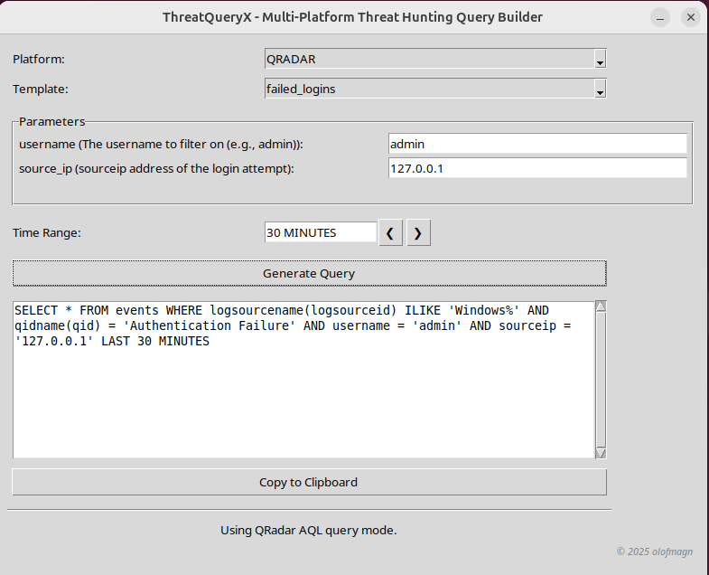

#  ThreatQueryX - Multi-Platform Threat Hunting Query Builder
A cross-platform desktop GUI tool that helps security analysts build and customize threat hunting queries for platforms like:
- IBM QRadar
- Elasticsearch
- Microsoft Defender

The tool loads pre-defined YAML templates and allows you to select parameters such as IPs, ports, and time ranges—building valid and efficent queries dynamically without writing syntax by hand.

##  Features
-  Template-based Query Generation (via YAML files).
-  Dynamic Field Loading based on platform.
-  Time Range Selection & Navigation.
-  Platform-specific output.
-  Validation of input fields (e.g., IPs, integers).

## File structure
```
.
├── docs
│   ├── document.pdf
│   ├── document.tex
│   └── stix.png
├── pictures
│   ├── app.png
│   └── failed_logins_gui.png
├── README.md
├── requirements.txt
├── src
│   ├── cli.py
│   ├── gui.py
│   ├── __init__.py
│   └── main.py
├── templates
│   ├── defender.yaml
│   ├── elastic.yaml
│   └── qradar.yaml
└── utils
    ├── configuration.py
    └── generate_queries.py
```

## Requirements
- Python >= 3.10.
- External dependencies as listed in `requirements.txt`.

## Template Format (YAML)
Each platform (QRadar, Elasticsearch, Defender) has its own syntax and `base_queries` in their respective YAML files. See `templates/qradar.yaml`, `templates/elastic.yaml`, and `templates/defender.yaml` for platform-specific examples.

> [!NOTE]  
> The examples below demonstrate with the QRadar AQL syntax.


```yaml
base_queries:
  events: "SELECT username, QIDNAME(qid) as \"Event Type\", COUNT() as \"Event Count\" FROM events"
  network: "SELECT DATEFORMAT(devicetime, 'yyyy-MM-dd HH:mm:ss') as event_time, sourceip, sourceport, destinationip, destinationport FROM events"
  process: "SELECT DATEFORMAT(devicetime, 'yyyy-MM-dd HH:mm:ss') as event_time, sourceip, username, \"Command\", \"Process Name\" FROM events"
  exploit: "SELECT DATEFORMAT(devicetime, 'yyyy-MM-dd HH:mm:ss') as event_time, sourceip, destinationip, \"Command\" FROM events"
  dns: "SELECT DATEFORMAT(devicetime, 'yyyy-MM-dd HH:mm:ss') as event_time, sourceip, destinationip, \"URL Domain\" FROM events"
```

Failed login template:
```yaml
failed_logins:
  description: "Search for audit failures with optional filters."
  base: "{authentication}"
  required_fields:
    - "logsourcename(logsourceid) ilike '%Windows%'"
  optional_fields:
    event_id:
      pattern: "eventid = '{value}'"
      type: str
      help: "Filter by Windows event ID"
    username:
      pattern: "username ilike '%{value}%'"
      type: str
      help: "Filter by username (substring match)"
    source_ip:
      pattern: "sourceip = '{value}'"
      type: str
      help: "Filter by source IP address"
```

Each template (e.g., `failed_logins`) defines the structure of a query, where `base` represents the table query logic. The `required_fields` identifies mandatory parameters to construct an effective query and are typically determined by the implementer during the template design phase. The `optional_fields` section allows the template to support additional user-defined input to customize the search. 

> [!TIP]
> Personally, I like to use threshold queries for anomaly detection. For example, combining `base_query: events` with template `usernames_with_high_eventcount` generates:
> 
> ```sql
> SELECT username, QIDNAME(qid) as "Event Type", COUNT() as "Event Count" 
> FROM events 
> WHERE username is NOT NULL 
> GROUP BY username, qid 
> HAVING COUNT() > 1000 
>   AND username ILIKE '%admin%' 
> LAST 30 MINUTES
> ```
> 
> This helps identify accounts with unusually high activity that might indicate compromise or misuse with `optional_field: admin`.


Each `optional_fields` must include a `pattern` (used for input validation) and a `help` text, which provides guidance on the field's purpose. This is useful in CLI mode or automated workflows. For Defender queries, an optional field `post_pipeline` allows you to toggle between raw event searches and structured, aggregated results (e.g., counts grouped by relevant fields). 

Finally, the `validation` block, defines the backend checks to ensure the provided input adheres to expected formats or values. For more practical examples, see the `Usage` section. 

> [!IMPORTANT]  
> Please check your field mappings, as they might differ from those defined in the templates since some of them are custom implemented. For example, for **Request Mode** to work in Qradar platform: `("Request Mode" ilike '%POST%' or "Request Mode" ilike '%GET%')` the field must be correctly mapped and parsed in your environment to fetch HTTP verbs.


### Adding New Templates
To add a new template, simply append a new entry string using the same structure to the appropriate YAML file (e.g., `templates/elastic.yaml`).


> [!IMPORTANT]  
> Note that some templates have `base:{events}` (that involves counts) do not use any projection or sorting by dates since we are focusing on raw events and further research:

>```yaml
> usernames_with_high_eventcount:
> description: "Detect suspicious high event count from users"
>  base: "{events}"
>  required_fields:
>   - "username is NOT NULL GROUP BY username, qid HAVING COUNT() > 1000"
>  optional_fields:
>    username:
>      pattern: "username ilike '%{value}%'"
>      type: str 
>      help: "Filter by username"
>```
>
> This helps identify anomalies or events that might be interesting for further analysis.


## Not sure on how to use the information from the searches?
- Checkout `docs/document.pdf` where I provide general opinions on how to perform threat hunting.
- But in general, the below Side-by-Side Circular flow illustrate the process on how I do it:

```

 ┌─────────────────────┐                   ┌─────────────────────┐
 │ Done with hunt |    │ ◄ -----Done------ │    Analysis         │
 │ Instanitate new     │                   │                     │                     
 └─────────┬───────────┘                   └─────────────────────┘
           │                                          ▲  
           │                                          │  
           ▼                                          │
┌─────────────────────┐                    ┌─────────────────────┐
│       Start         │                    │   Perform deep      │ 
│                     │                    │   searches          │
└──────────┬──────────┘                    └─────────────────────┘
           │                                          ▲  
           │                                          │ 
           │                                          │  
           │                               ┌─────────────────────┐ 
           │                               │   Correlate data    │
           │                               └─────────────────────┘
           │                                          ▲
           │                                          │
           │                                          │
           ▼                                          │
┌─────────────────────┐                    ┌─────────────────────┐
│  Define template && │                    │   Get result from   │
│  Issue query        │                    │    query            │
└──────────┬──────────┘                    └─────────────────────┘
           │                                          ▲        
           │                                          │
           │                                          │
           ▼                                          │
┌─────────────────────┐                    ┌─────────────────────┐
│ Get result from     │                    │ Use optional        │
│ query               │                    │ fields              │
└──────────┬──────────┘                    └─────────────────────┘
           │                                           ▲
           │                                           │
           ▼                                           │
┌─────────────────────┐                                │
│ Correlate data      │                                │
└──────────┬──────────┘                                │
           │                                           │
           │                                           │
           ▼                                           │
┌─────────────────────┐         ◇──────────◇           │
│ Checking field      │         │ Optional │           │
│ statistics          │-------▶ │ fields   │----Yes----┘
└─────────────────────┘         │ needed?  │
                                ◇────┬─────◇
                                     |
                                     No
                                     | 
                                     ▼
                              ┌─────────────────────┐
                              │ Perform deep        │
                              │ searches            │
                              └──────┬──────────────┘ 
                                     │
                                     │
                                     ▼                  
                              ┌─────────────────────┐ 
                              │   Analysis          │
                              │                     │
                              └─────────────────────┘
                                     │
                                     │
                                     ▼ 
                              ┌─────────────────────┐                ┌─────────────────────┐
                              │   Done with hunt    │                │ Go back to start    │ 
                              │                     │ -------------▶ │                     │ 
                              └─────────────────────┘                └─────────────────────┘
```


> [!NOTE]  
>  The `optional_fields` allows some flexibility since some of the queries are statically defined because they focus on a specific behaviour or pattern to capture. I'll specify this in a more detail in the above template format section.


##  Usage

### GUI:
```python3
python3 src.main
```

```bash
  _   _                    _                                   
 | |_| |__  _ __ ___  __ _| |_ __ _ _   _  ___ _ __ _   ___  __
 | __| '_ \| '__/ _ \/ _` | __/ _` | | | |/ _ \ '__| | | \ \/ /
 | |_| | | | | |  __/ (_| | || (_| | |_| |  __/ |  | |_| |>  < 
  \__|_| |_|_|  \___|\__,_|\__\__, |\__,_|\___|_|   \__, /_/\_\
                                 |_|                |___/      

Welcome to the application! 
Enjoy using the app, and feel free to share any feature requests or feedback!
Version 1.0.0 olofmagn

? Choose interface mode: (Use arrow keys)
   CLI (terminal)
 » GUI (graphical)
   Quit

```


Example of autogenerated query using the template `failed_logins` for the platform `qradar`:



### CLI:

```python3
python3 -m src.main
```

```bash
  _   _                    _
 | |_| |__  _ __ ___  __ _| |_ __ _ _   _  ___ _ __ _   ___  __
 | __| '_ \| '__/ _ \/ _` | __/ _` | | | |/ _ \ '__| | | \ \/ /
 | |_| | | | | |  __/ (_| | || (_| | |_| |  __/ |  | |_| |>  <
  \__|_| |_|_|  \___|\__,_|\__\__, |\__,_|\___|_|   \__, /_/\_\
                                 |_|                |___/

Welcome to the application! 
Enjoy using the app, and feel free to share any feature requests or feedback!
Version 1.0.0 olofmagn

? Choose interface mode: CLI (terminal)
? Choose a platform to use: qradar - IBM QRadar
? Choose a template to use: failed_logins - Search for authentication failures w
ith optional filters.
username (Filter by username): admin
source_ip (Filter by sourceip address): 127.0.0.1
Time range (default '10 MINUTES'): 30 minutes
Generated query:

SELECT DATEFORMAT(devicetime, 'yyyy-MM-dd HH:mm:ss') as event_time, sourceip, username FROM events where logsourcename(logsourceid) ILIKE 'Windows%' and qidname(qid) = 'Authentication Failure' and username ILIKE 'admin' and sourceip = '127.0.0.1' ORDER BY devicetime DESC LAST 30 MINUTES
```

## Resources

**Official Documentation:**
- [QRadar AQL Query Structure](https://www.ibm.com/docs/en/qradar-on-cloud?topic=aql-query-structure) - Official IBM documentation on AQL syntax and structure
- [Kusto Query Language (KQL)](https://learn.microsoft.com/en-us/kusto/query/?view=azure-data-explorer&preserve-view=true) - Official Microsoft documentation on KQL for Azure Data Explorer and Sentinel
- [Kibana Query Language (KQL)](https://www.elastic.co/docs/explore-analyze/query-filter/languages/kql) - Official Elastic documentation on KQL syntax and usage

**Community Resources:**
- [QRadar AQL Queries](https://github.com/System-CTL/QRadar-AQL-Queries) - Additional AQL query examples and patterns (friend of mine and updates regularly)

##  License
This project is open-source and licensed under the MIT License. See the LICENSE file for details.
