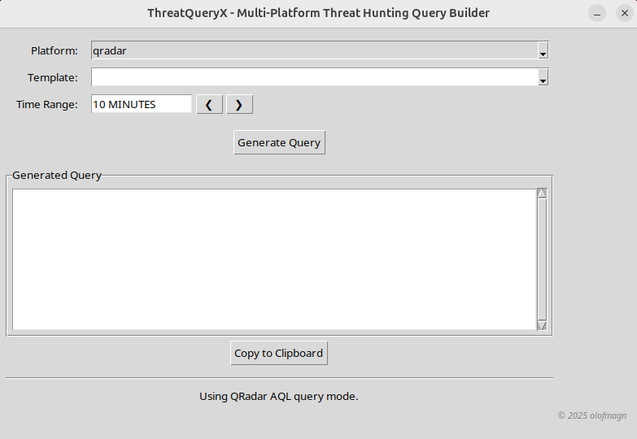

#  ThreatQueryX - Multi-Platform Threat Hunting Query Builder
A cross-platform desktop GUI tool that helps security analysts build and customize threat hunting queries for platforms like:
- AQL (QRadar)
- Elasticsearch
- Microsoft Defender

The tool loads pre-defined YAML templates and allows you to select parameters such as IPs, ports, and time ranges—building valid queries dynamically without writing syntax by hand.

##  Features
-  Template-based Query Generation (via YAML files).
-  Dynamic Field Loading based on platform.
-  Time Range Selection & Navigation.
-  Platform-specific output (AQL, KQL, Elastic DSL).
-  Validation of input fields (e.g., IPs, integers).

## File structure
```
.
├── docs
│   ├── document.pdf
│   ├── document.tex
│   └── stix.png
├── pictures
│   ├── app.png
│   └── failed_logins_gui.png
├── README.md
├── requirements.txt
├── src
│   ├── cli.py
│   ├── gui.py
│   ├── __init__.py
│   └── main.py
├── templates
│   ├── defender.yaml
│   ├── elastic.yaml
│   └── qradar.yaml
└── utils
    ├── configuration.py
    └── generate_queries.py
```

## Requirements
- Python >= 3.10.
- External dependencies as listed in `requirements.txt`.

## Template Format (YAML)
Each platform (QRadar, Elasticsearch, Defender) has its own syntax and base queries in their respective YAML files. See `templates/qradar.yaml`, `templates/elastic.yaml`, and `templates/defender.yaml` for platform-specific examples.

The examples below demonstrate QRadar AQL syntax.

```yaml
base_queries:
  authentication: "SELECT DATEFORMAT(devicetime, 'yyyy-MM-dd HH:mm:ss') as event_time, sourceip, username FROM events"
  network: "SELECT DATEFORMAT(devicetime, 'yyyy-MM-dd HH:mm:ss') as event_time, sourceip, sourceport, destinationip, destinationport FROM events"
  process: "SELECT DATEFORMAT(devicetime, 'yyyy-MM-dd HH:mm:ss') as event_time, sourceip, username, \"Command\", \"Process Name\" FROM events"
  exploit: "SELECT DATEFORMAT(devicetime, 'yyyy-MM-dd HH:mm:ss') as event_time, sourceip, destinationip, \"Command\" FROM events"
  dns: "SELECT DATEFORMAT(devicetime, 'yyyy-MM-dd HH:mm:ss') as event_time, sourceip, destinationip, \"URL Domain\" FROM events"
```
Failed login template:
```yaml
failed_logins:
  description: "Identify failed sign-in attempts in Defender logs."
  base: "IdentityLogonEvents"
  required_fields:
    - "LogonType == 'Interactive' and ActionType == 'LogonFailed'"
  optional_fields:
    username:
      pattern: "AccountName has '{value}'"
      type: str
      help: "Filter by username"
    source_ip:
      pattern: "IPAddress == '{value}'"
      type: str
      help: "Filter by sourceip"
      validation: "ip"
  post_pipeline: "project AccountName, DeviceName, IPAddress, Timestamp"
```

Each template (e.g., `failed_logins`) defines the structure of a query, where `base` represents the foundational query logic. The `required_fields` specify mandatory parameters necessary to construct an effective query and are typically determined by the implementer during the template design phase. The `optional_fields` section allows the template to support additional user-defined input to customize the search. 

Each `optional_fields` must include a `pattern` (used for input validation) and a `help` text, which provides guidance on the field's purpose. This is particularly useful in CLI mode or automated workflows. For Defender queries, an optional `post_pipeline` allows you to toggle between raw event searches and structured, aggregated results (e.g., counts grouped by relevant fields). 

Finally, the `validation` block, defines the backend checks to ensure the provided input adheres to expected formats or values. For more practical examples, see the `Usage` section. 

### Adding New Templates
To add a new template, simply append a new entry string using the same structure to the appropriate YAML file (e.g., `templates/elastic.yaml`). No code changes are required.

##  Pending Features
- Add integration with a yamlbuilder to automate threat-hunting templates using ML/AI on a local setup.
- Save custom query profiles based on current threat-landscape that can be easily translated into queries.

##  Usage

### GUI:
```python3
python3 src.main
```

```bash
  _   _                    _                                   
 | |_| |__  _ __ ___  __ _| |_ __ _ _   _  ___ _ __ _   ___  __
 | __| '_ \| '__/ _ \/ _` | __/ _` | | | |/ _ \ '__| | | \ \/ /
 | |_| | | | | |  __/ (_| | || (_| | |_| |  __/ |  | |_| |>  < 
  \__|_| |_|_|  \___|\__,_|\__\__, |\__,_|\___|_|   \__, /_/\_\
                                 |_|                |___/      

Welcome to the application! 
Enjoy using the app, and feel free to share any feature requests or feedback!
Version 1.0.0 olofmagn

? Choose interface mode: (Use arrow keys)
   CLI (terminal)
 » GUI (graphical)
   Quit

```



Example of autogenerated query using the template `failed_logins` for the platform `qradar`:


### CLI:

```python3
python3 -m src.main
```

```bash
  _   _                    _
 | |_| |__  _ __ ___  __ _| |_ __ _ _   _  ___ _ __ _   ___  __
 | __| '_ \| '__/ _ \/ _` | __/ _` | | | |/ _ \ '__| | | \ \/ /
 | |_| | | | | |  __/ (_| | || (_| | |_| |  __/ |  | |_| |>  <
  \__|_| |_|_|  \___|\__,_|\__\__, |\__,_|\___|_|   \__, /_/\_\
                                 |_|                |___/

Welcome to the application! 
Enjoy using the app, and feel free to share any feature requests or feedback!
Version 1.0.0 olofmagn

? Choose interface mode: CLI (terminal)
? Choose a platform to use: qradar - IBM QRadar
? Choose a template to use: failed_logins - Search for authentication failures w
ith optional filters.
username (Filter by username): admin
source_ip (Filter by sourceip address): 127.0.0.1
Time range (default '10 MINUTES'): 30 minutes
Generated query:

SELECT DATEFORMAT(devicetime, 'yyyy-MM-dd HH:mm:ss') as event_time, sourceip, username FROM events where logsourcename(logsourceid) ILIKE 'Windows%' and qidname(qid) = 'Authentication Failure' and username ILIKE 'admin' and sourceip = '127.0.0.1' ORDER BY devicetime DESC LAST 30 MINUTES
```

##  License
This project is open-source and licensed under the MIT License. See the LICENSE file for details.
