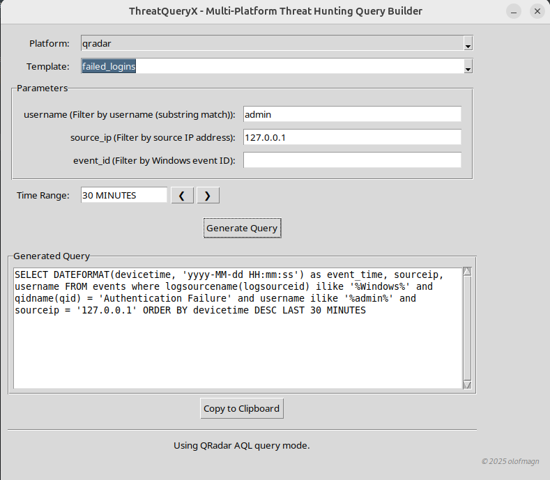

#  ThreatQueryX - Multi-Platform Threat Hunting Query Builder
A cross-platform desktop GUI tool that helps security analysts build and customize threat hunting queries for platforms like:
- AQL (QRadar)
- Elasticsearch
- Microsoft Defender

The tool loads pre-defined YAML templates and allows you to select parameters such as IPs, ports, and time ranges—building valid queries dynamically without writing syntax by hand.

## 🚀 Features
-  Template-based Query Generation (via YAML files)
-  User-friendly GUI with tkinter
-  Dynamic Field Loading based on platform
-  Time Range Selection & Navigation
-  Platform-specific Output (AQL, KQL, Elastic DSL)
-  Validation of input fields (e.g., IPs, integers)
-  Easily extendable with new platforms/templates

## 📁 Project structure
```
siemqueryx/
├── docs/ # Guidelines on how to conduct threat-hunting in general
├── templates/ # Templates of all search logic
│   ├── qradar.yaml
│   ├── elastic.yaml
│   └── defender.yaml
├── main.py # Main logic
├── utils.py # Utility functions
└── README.md
```

## 🧾 Template Format (YAML)
Each includes, for example using `failed_logins` for the platform `qradar`:
```yaml
failed_logins:
  description: "Search for authentication failures with optional filters."
  base: "SELECT * FROM events"
  required_fields:
    - "logsourcename(logsourceid) ILIKE 'Windows%'"
    - "qidname(qid) = 'Authentication Failure'"
  optional_fields:
    username:
      pattern: "username = '{value}'"
      help: "The username to filter on (e.g., admin)"
    source_ip:
      pattern: "sourceip = '{value}'"
      help: "sourceip address of the login attempt"
      validation: "ip"
```

As indicated, `failed_logins` defines the template structure. The `required_fields` are necessary to optimize and enhance the effectiveness of the search, and they are typically defined by the implementer in the initial phase based on the template. The `optional_fields`, along with a `pattern`, are used to gather and hold additional input from the user to further enrich the search criteria. The variable `help` is to provide useful information about the purpose of each field. This is especially helpful when running the application in cli mode or during automation tasks. See section `Usage` for more details. Finally, `validation` is used to validate the field in the backend based on its characteristics.


## 🧩 Adding New Templates
Just add a new entry following the above structure to the YAML file under the appropriate platform (e.g., templates/elastic.yaml). No code changes needed.


## 🧠 Future Ideas
- Add integration with `yamlbuilder.py` to automate threat-hunting templates using ML/AI on a local setup.
- Save custom query profiles based on current threat-landscape that can be easily translated into queries.

## 📦 Usage

### GUI:
```python3
python3 main.py
```

```bash
  _   _                    _                                   
 | |_| |__  _ __ ___  __ _| |_ __ _ _   _  ___ _ __ _   ___  __
 | __| '_ \| '__/ _ \/ _` | __/ _` | | | |/ _ \ '__| | | \ \/ /
 | |_| | | | | |  __/ (_| | || (_| | |_| |  __/ |  | |_| |>  < 
  \__|_| |_|_|  \___|\__,_|\__\__, |\__,_|\___|_|   \__, /_/\_\
                                 |_|                |___/      

Welcome to the application! 
Enjoy using the app, and feel free to share any feature requests or feedback!
Designed by Olof Magnusson (olofmagn)

? Choose interface mode: (Use arrow keys)
   CLI (terminal)
 » GUI (graphical)
   Quit

```


Example of autogenerated query using the template `failed_logins` for the platform `qradar`:



### CLI:

```python3
python3 main.py
```

```bash
  _   _                    _                                   
 | |_| |__  _ __ ___  __ _| |_ __ _ _   _  ___ _ __ _   ___  __
 | __| '_ \| '__/ _ \/ _` | __/ _` | | | |/ _ \ '__| | | \ \/ /
 | |_| | | | | |  __/ (_| | || (_| | |_| |  __/ |  | |_| |>  < 
  \__|_| |_|_|  \___|\__,_|\__\__, |\__,_|\___|_|   \__, /_/\_\
                                 |_|                |___/      

Welcome to the application! 
Enjoy using the app, and feel free to share any feature requests or feedback!
Designed by Olof Magnusson (olofmagn)

? Choose interface mode: (Use arrow keys)
 » CLI (terminal)
   GUI (graphical)
   Quit

? Choose a platform to use: (Use arrow keys)
   defender - Microsoft Defender for Endpoint
   elastic - Elastic SIEM
 » qradar - IBM QRadar
   Quit

Choose a template to use: (Use arrow keys)
 » failed_logins - Search for authentication failures with optional filters.
   firewall_block - Detect firewall blocks by protocol and port.
   rce_attempts - Detect potential remote command execution attempts in logs.
   powershell_execution - Find suspicious PowerShell execution events.
   rdp_loopback_traffic - Detect RDP (port 3389) traffic involving loopback addresses (127.0.0.0/8) using Event ID 5156.
   builtin_account_enabled - Detect when built-in accounts like Guest, DefaultAccount, or Administrator are enabled.

? Choose interface mode: CLI (terminal)
? Choose a platform to use: qradar - IBM QRadar
? Choose a template to use: failed_logins - Search for authentication failures with optional filters.

Search for authentication failures with optional filters.

username (The username to filter on (e.g., admin)): admin
source_ip (sourceip address of the login attempt): 127.0.0.1
Time range (default '10 MINUTES'): 30 minutes

Generated Query:

SELECT * FROM events WHERE logsourcename(logsourceid) ILIKE 'Windows%' AND qidname(qid) = 'Authentication Failure' AND username = 'admin' AND sourceip = '127.0.0.1' LAST 30 MINUTES
```

## 📝 License
This project is open-source and licensed under the MIT License. See the LICENSE file for details.
